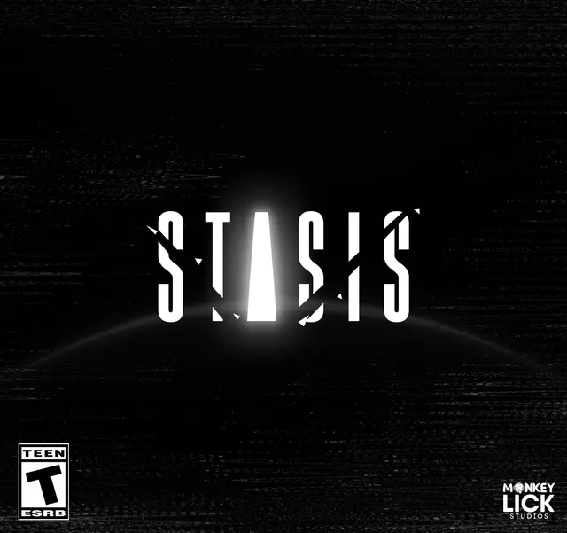

<!-- PROJECT LOGO -->

[![Product Name Screen Shot][product-screenshot]](https://www.monkeylick.studio/)

<!-- ABOUT THE PROJECT -->

## About The Project

 

  

<h3 align="center">Stasis</h3>

  

    This project is a psychological horror game set on an abandoned space station orbiting an uninhabited planet in our solar system. Players take on the role of a lone astronaut/engineer sent to investigate a mysterious signal emanating from the station. Upon arrival, they encounter a distinct alien entity with terrifying abilities, turning what was supposed to be a routine investigation into a fight for survival. The gameplay combines elements of resource management, stealth, and puzzle-solving as players navigate through the eerie, malfunctioning station, attempting to escape while unraveling the mystery behind the alien presence. With limited communication to mission control, a damaged ship, and a malfunctioning tablet, players must outsmart the alien and reach an emergency escape pod. The game culminates in a chilling twist that suggests the nightmare may not be over, even after escaping the station.
     
     
    <a href="https://www.monkeylick.studio/">View Demo/Site</a>
  

## The Team!

<!-- LICENSE -->

## License

Distributed under the Unlicense License. See `LICENSE.txt` for more information.

(<a href="#readme-top">back to top</a>)

<!-- MARKDOWN LINKS & IMAGES -->
<!-- https://www.markdownguide.org/basic-syntax/#reference-style-links -->

[contributors-shield]: https://img.shields.io/github/contributors/Sterling-Gore/Game-Dev.svg?style=for-the-badge
[contributors-url]: https://github.com/Sterling-Gore/Game-Dev/graphs/contributors
[forks-shield]: https://img.shields.io/github/forks/Sterling-Gore/Game-Dev.svg?style=for-the-badge
[forks-url]: https://github.com/Sterling-Gore/Game-Dev/network/members
[stars-shield]: https://img.shields.io/github/stars/Sterling-Gore/Game-Dev.svg?style=for-the-badge
[stars-url]: https://github.com/Sterling-Gore/Game-Dev/stargazers
[issues-shield]: https://img.shields.io/github/issues/Sterling-Gore/Game-Dev.svg?style=for-the-badge
[issues-url]: https://github.com/Sterling-Gore/Game-Dev/issues
[license-shield]: https://img.shields.io/github/license/Sterling-Gore/Game-Dev.svg?style=for-the-badge
[license-url]: https://github.com/Sterling-Gore/Game-Dev/blob/master/LICENSE.txt
[linkedin-shield]: https://img.shields.io/badge/-LinkedIn-black.svg?style=for-the-badge&logo=linkedin&colorB=555
[linkedin-url]: https://linkedin.com/in/linkedin_username
[product-screenshot]: images/screenshot.png
